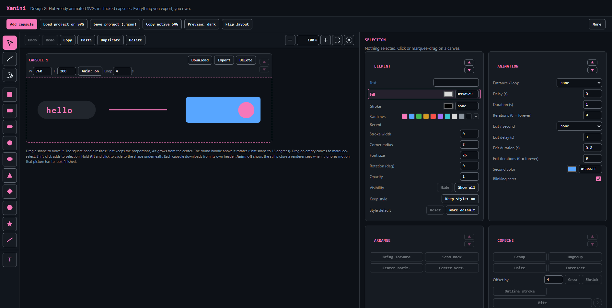

# Xanini

>Draws animated SVG banners, icons and diagrams in the browser that render on GitHub.
>Download and keep anything you create. No dependencies. No login required.

[**Try it live**](https://fabian-galvez.github.io/Xanini/) | [Controls reference](docs/controls.md) | [Animate your README](docs/animate-your-readme.md)

| Runs on | Any browser. Windows, Linux, macOS |
| --- | --- |

 

---

 

## Dashboard

 

---

 

## Download and run

One file. No framework, no build step, no package manager, no CDN, no web
font, and no network call. Nothing you create leaves your machine.

| Where         | Action                                                   |
| ------------- | -------------------------------------------------------- |
| Online        | [Open it](https://fabian-galvez.github.io/Xanini/)           |
| Offline       | Download [index.html](index.html) and double-click it    |
| Every control | [docs/controls.md](docs/controls.md) and in the app menu |
The GitHub Pages copy and the downloaded file are the same file. Download it
to work offline.

| Step | Action                                                                                                                                                        |
| ---- | ------------------------------------------------------------------------------------------------------------------------------------------------------------- |
| 1    | Add shapes and text to a capsule.                                                                                                                             |
| 2    | Give the shapes an entrance and exit animation                                                                                                                |
| 3    | Set Loop, so the shape or capsule animation repeats instead of playing once                                                                                   |
| 4    | Download the capsule to save a single .svg file to your computer. Save the project to download all capsules and save all .svg files currently being worked on |
| 5    | Put it in your README with ``                                                                                                  |

 

---

 

## Render Test

These animations were made with Xanini. They check that each kind of motion renders on your device.
 
The gray labels never move, but if a row does not animate on your device, please open a
[device report](../../issues/new?template=device-report.md).

| Row      | Tests                                     | Failures                                |
| -------- | ----------------------------------------- | --------------------------------------- |
| 1 slide  | translate on a text node                  | Text stuck above position, or missing   |
| 2 fade   | opacity                                   | Text missing                            |
| 3 color | fill animation                            | Text never changes color               |
| 4 draw   | stroke-dashoffset with a real dash length | Bar solid or dotted, never drawing      |
| 5 type   | textPath on a growing path                | Text appears all at once, or not at all |
| 6 turn   | scale and rotate about center             | Square static, or off position          |
 

> [!Caution]
> GitHub starts SVG animations when the page loads, not when a reader scrolls to it. 
>
> This causes single-run animations (Loop set to 0) to be missed.

> [!TIP]
> Delay the animation entrance or loop the whole animation to fix this.

 

---

 

## Exported files

An SVG you exported opens again in the app exactly as it was downloaded.

| Export Contents                                                                        | Reason                                                                                                                                                        |
| -------------------------------------------------------------------------------------- | ------------------------------------------------------------------------------------------------------------------------------------------------------------- |
| No metadata: no comment, no title, no date, no software name                           | Xanini writes no `metadata`, `title` or `desc` element in the first place. [DataPeel](https://github.com/Fabian-Galvez/DataPeel) reads no entries in an exported file |
| A `prefers-reduced-motion` rule                                                        | The animation does not play for a reader who has that setting on                                                                                          |
| `width`, `height` and a matching `viewBox` outline with nothing outside of it rendered | Anything outside the capsule box is cropped out                                                                                                               |
| No scripts, no external references                                                     | GitHub sanitizes SVGs in a README. A script or a remote reference gets stripped or blocked                                                                    |
| Text with a pinned `textLength`                                                        | Stops the string of text from rendering at different widths on different platforms                                                                            |
| Shapes stay visible with motion off                                                    | A renderer that ignores motion still shows the shape, including one whose animation starts off screen                                                         |

 

---

 

## All Files

| File                                                       | Contents                                                                                            |
| ---------------------------------------------------------- | --------------------------------------------------------------------------------------------------- |
| [index.html](index.html)                                   | The whole app. It runs as the live GitHub page, or download it and open it offline                  |
| [docs/controls.md](docs/controls.md)                       | Buttons and shortcuts. Learn to use Xanini. Also in the app's menu                                  |
| [docs/animate-your-readme.md](docs/animate-your-readme.md) | Putting a banner in a README, and the size rules for GitHub and Obsidian                            |
| [LICENSE](LICENSE)                                         | MIT, for this app                                                                                   |
